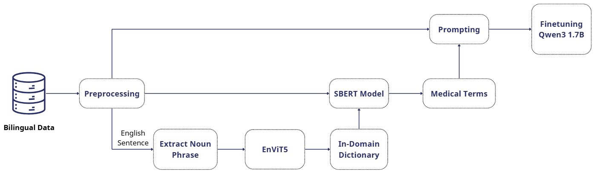

# Methodology
This is the overview workflow of our method proposed for VLSP2025 shared task: *Medical Machine Translation with
Limited Parameters and Resources Using Pretrained Models*. 
We leverage terminology reference in the finetuning process using QLoRa technique for two way medical translation: English to Vietnamese and vise versa.

# Code 

## Create glossary from corpus

## Make prompt for supervised fine-tuning (SFT)

## Fine tune model

## Inference

